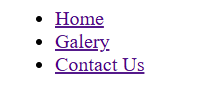
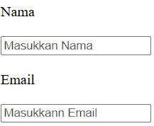
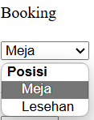

# Intermediate Assignment

## Checkpoint #1 

Using several tags that help in the formation of HTML structure.

Some of the HTML tags mentioned include:

- img: used to embed images in a webpage.

- ul and li: used to create unordered lists.

- a: used to create hyperlinks.

- dl, dd, and dt: used to create description lists.

- input type="text", type="email", type="number", and type="submit": used to input text, email addresses, numbers, and submit forms, respectively.

- textarea: used to input text with a larger size.

- select: used to create dropdown boxes.

These tags are used to structure and format content on web pages, making them visually appealing and functional

 img tag

 ul and li tag

 text and email tag

 select tag
